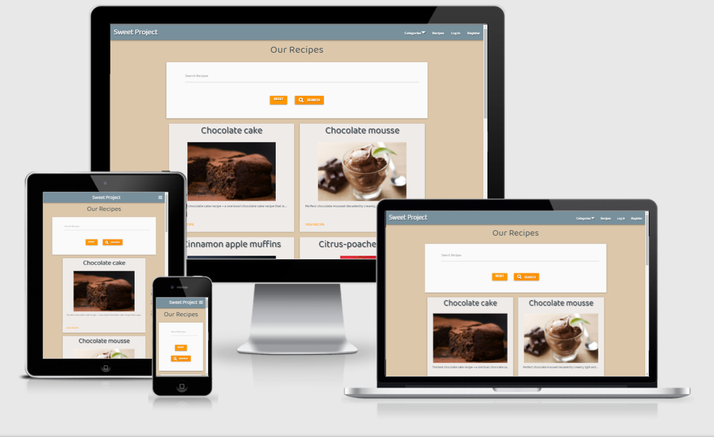
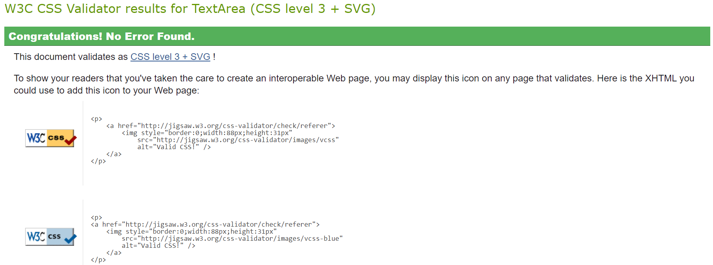
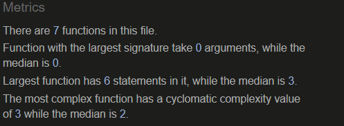
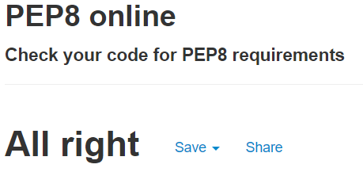

# [The Sweet Project](https://ruioliveira83.github.io/MP3)

The main purpose of this project is to create a full-stack website where the community can share and search dessert recipes in an easy to navigate and clean looking website, using HTML, CSS, JavaScript, Python, Flask and MongoDB.
This website is my third milestone project for the diploma in software development from the [code institute](https://codeinstitute.net). 
A live view of this website can be found here: [The Sweet Project](https://sweet-recipes-project.herokuapp.com/).

---
## Index
* [UX](#ux)
  - [User Stories](#user-stories)
  - [Wireframes](#wireframes)
* [Features](#features)
  - [Existing Features](#existing-features)
  - [Features to be Implemented in the Future](#features-to-be-implemented-in-the-future)
* [Technologies Used](#technologies-used)
  - [Languages Used](#languages-used)
  - [Frameworks and Libraries Used](#frameworks-and-libraries-used)
* [Testing](#testing)
  - [Code Validators](#code-validators)
  - [Responsiveness of the website](#responsiveness-of-the-website)
  - [Functionality of the website](#functionality-of-the-website)
  - [Browser compatibility](#browser-compatibility)
  - [Testing User Stories](#testing-user-stories)
* [Deployment](#deployment)
  - [Requirements for Deployments](#requirements-for-deployments)
  - [Initial Deployment](#initial-deployment)
  - [How to Fork the project](#how-to-fork-the-project)
  - [How to Clone the project](#how-to-clone-the-project)
* [Credits](#credits)
  - [Content](#content)
  - [Acknowledgements](#acknowledgements)

---


## UX

### User Stories
* As a regular user, I want a website responsive and good looking on all devices;
* As a regular user, I want a website easy to navigate;
* As a regular user, I want to see and get inspired by dessert recipes;
* As a regular user, I want to be able to search recipes;
* As a regular user, I want to see all the recipes in each category;
* As a registered user, I want to have all the functionalities of a regular user and some extra functionalities;
* As a registered user, I want to add new recipes;
* As a registered user, I want to be able to edit my recipes;
* As a registered user, I want to be able to delete my recipes;
* As a registered user, I want to quickly see all my recipes;
* As an Admin user, I want to have all the functionalities of a registered user and some extra functionalities;
* As an Admin member, I want to be able to edit any recipes;
* As an Admin member, I want to be able to delete any recipes;
* As an Admin member, I want to check what categories are available;
* As an Admin member, I want to be able to add a category;
* As an Admin member, I want to be able to delete a category;


### Wireframes
It was used [Balsamiq](https://balsamiq.com/) to create the following wireframes:
| Desktop                                                        | Tablet and Mobile                                             |
| -------------------------------------------------------------- | ------------------------------------------------------------- |
| [Home](wireframes/desktop-home.png)                            | [Home](wireframes/mobile-home.png)                            |
| [Register](wireframes/desktop-register.png)                    | [Register](wireframes/mobile-register.png)                    |
| [Log in](wireframes/desktop-log-in.png)                        | [Log in](wireframes/mobile-log-in.png)                        |
| [Add Recipe](wireframes/desktop-add-recipe.png)                | [Add Recipe](wireframes/mobile-add-recipe.png)                |
| [Edit Recipe](wireframes/desktop-edit-recipe.png)              | [Edit Recipe](wireframes/mobile-edit-recipe.png)              |
| [Manage Categories](wireframes/desktop-manage-categories.png)  | [Manage Categories](wireframes/mobile-manage-categories.png)  |
| [User Page](wireframes/desktop-user-page.png)                  | [User Page](wireframes/mobile-user-page.png)                  |

---
## Features
### Existing Features
The users of this website can be divided into 3 categories: **Unregistered user**, **Registered user** and **Admin**.
All pages of this website share the same footer, this footer allows the user to go to the social media pages of this brand.

The **Unregistered users** can see and search all the recipes and can filter the recipes by category.
On the unregistered users' header there are 4 options:
- return home and see all the recipes;
- filter the recipes by categories and see all the recipes for each category;
- log in, if the unregistered user has an account and want to enter the account;
- register, if the unregistered user wants to create an account and become a registered user.

The **registered users** can see and search all the recipes and can filter the recipes by category.
**Registered users** can add new recipes.
**Registered users** can edit and delete the recipes added by them.
On the registered users' header there are 5 options:
- return home and see all the recipes;
- filter the recipes by categories and see all the recipes for each category;
- go to the user's page, to see all the recipes added by the user;
- add new recipes;
- log out.

The **Admin users** can see and search all the recipes and can filter the recipes by category.
**Admin users** can add new recipes.
**Admin users** can edit and delete all the recipes.
**Admin users** can add new categories and delete categories.
The admin users' header is similar to the registered users' header but has an extra option to manage categories.

The **Home** page has a section with a search bar, where the user can search for a recipe.
Below the search bar, there are up to 8 cards with recipes. The Home page is paginated and there is a limit of 8 cards per page. Each card has the option of opening the recipe page. If the user is an admin user, or if the recipe was added by the logged user, there are 2 additional options: edit or delete the recipe.

The **My_recipes** page shows cards with the recipes added by the user. Each card has three options:
- View recipe;
- Delete Recipe;
- Edit Recipe.
The my_recipes page is paginated and there is a limit of 8 cards per page.

The **Recipe** page has:
- the recipe name;
- a recipe picture (if a picture wasn't added when the recipe was added a generic picture will be shown);
- A list with the recipe categories. The displayed categories have a link to all the recipes with the same category;
- A recipe description;
- The recipe ingredients;
- The recipe method;
- If the recipe was added by the user there will be 2 buttons on the bottom that allow the user to edit or delete the recipe.

The **Add Recipe** page has a form where the user can add:
- Recipe's name;
- Recipe's description;
- Recipe's Categories;
- Recipe's Ingredients;
- Recipe's Method;
- Recipe image's URL.
At the bottom of the page, there is a button to add the recipe to the database.

The **Edit Recipe** page has the same form as in the edit recipe, but the form is pre-filled with the information to be edited.
At the bottom of the page there are two buttons:
- one edit button that will save the changes, edit the recipe and return to the user's my_recipe page;
- one cancel button that will return the user to the home page without saving the changes.

The **Register** and the **Log In** page have a similar format, with a place to insert the username and a place to insert the password.

It was used defensive programming on the delete function (both delete recipe and delete category). A category or a recipe can't be deleted with just one click, the user needs to confirm that he wants to delete the item, to avoid unintentional actions from the user.

### Features to be Implemented in the Future
- Add a favourite recipes page to allow the users to favourite some recipes and see all the recipes on one page.
- Associate this page to a brand of kitchenware.
---
## Technologies Used

### Languages Used
- [HTML5](https://en.wikipedia.org/wiki/HTML5)
  - The programming language used to provide content and structure.
- [CSS3](https://en.wikipedia.org/wiki/CSS)
  - The programming language used to format the styling.
- [JavaScript](https://en.wikipedia.org/wiki/JavaScript)
  - The programming language used to make the web page interactive.
- [Python (including Jinja)](https://www.python.org/)
  - The programming language used to build the backend functionality.
### Frameworks and Libraries Used
- [Gitpod](https://gitpod.io/)
  - IDE (Integrated Development Environment) used to develop this project.
- [GitHub](https://github.com/)
  - The code hosting platform used to host the project.
- [Heroku](https://dashboard.heroku.com/)
  - Cloud platform used to deploy the website.
- [MongoDB](https://www.mongodb.com/)
  - Fully managed cloud database service used to store all the data for this project.
- [Flask](https://flask.palletsprojects.com/)
  -  Web framework used to provide libraries, tools and technologies for this project.
- [Werkzeug](https://werkzeug.palletsprojects.com/)
  - Comprehensive WSGI web application library used for password hashing, authentication and authorization.
- [Balsamiq](https://balsamiq.com/)
  - The software used to create the project's wireframes.
- [Materialize](https://materializecss.com/)
  - In-built JavaScript package for interactive and responsive web-design.
- [Google Fonts ](https://fonts.google.com/)
  - Font families library used to provide the font "Baloo Tammudu 2" and "lobster".
- [jQuery](https://en.wikipedia.org/wiki/JQuery)
  - JavaScript library used to simplify the JavaScript code.
- [W3C Markup Validator](https://validator.w3.org/)
  - The markup validation service used to check for errors in the HTML code.
- [Jigsaw](https://jigsaw.w3.org/css-validator)
  - The CSS validation service used to check for errors in the CSS code.
- [JSHint](https://jshint.com/)
  - The JavaScript validation service used to check for errors in the JavaScript code.
- [Chrome DevTools](https://developers.google.com/web/tools/chrome-devtools)
  - Chrome DevTools used to test the responsiveness of the site.
- [Responsive Design Checker](https://www.responsivedesignchecker.com/)
  - Responsive Design Checker used to test the responsiveness of the site.

---
## Testing
### Code Validators
- [HTML Validator](https://validator.w3.org/):
  - The Home page, login and register were checked by address and no errors or warnings were found.
  - All the other pages were checked via direct input and the only errors and warnings detected were due to the use of jinja language.
  
- [CSS Validator](https://jigsaw.w3.org/css-validator/#validate_by_input) (via direct input path):
  - No errors found:


- [JavaScript Validator](https://jshint.com/):
  - No errors found:


- [Python PEP8 Validator](http://pep8online.com/):
  - No errors found:


### Responsiveness of the website
It was used [Chrome DevTools](https://developers.google.com/web/tools/chrome-devtools) and
[Responsive Design Checker](https://www.responsivedesignchecker.com/)
 to test the responsiveness of the site.


The website structure adapts well to all used screen sizes.

### Functionality of the website
The responsiveness of all pages was tested:
- the website name on the top left corner returns you to the home page;
- the Categories dropdown menu shows all the available categories and, when clicked, shows all the recipes on the selected category;
- the Recipes button opens the home page where all the recipes are shown;
- the LogIn button opens the login page. On the login page, there is an option to go to the register page if the user is unregistered. If the user inserts a wrong username or a wrong password a flash message is shown saying "Incorrect Username and/or Password";
- the Register button opens the Register page. The register page has a log in option if the user is already registered;
- The "My Recipes" button directs the user to a page with all the recipes added by the user;
- The "Add Recipe" button returns a page where the user can add a new recipe;
- The Manage Categories button directs the admin user to a page where the user can add new categories and delete existing categories.

### Browser compatibility
The appearance and responsiveness of the website was tested with good results in 4 different web browsers: Microsoft Edge,
Mozilla Firefox, Google Chrome and Opera.

### Testing User Stories
* As a regular user, I want a website responsive and good looking on all devices;
  - A regular user will find a website with a balanced design and a clear structure in whatever device he chooses to use.
* As a regular user, I want a website easy to navigate;
  - A regular user will find a website with a clear structure making it easy to navigate.
* As a regular user, I want to see and get inspired by dessert recipes;
  - A regular user will find a lot of different recipes and a lot of pictures to get inspired.
* As a regular user, I want to be able to search recipes;
  - There's a search bar on top of the home page where the user can search for recipes. It will search words on the ingredients, title and category.
* As a regular user, I want to see all the recipes in each category;
  - A user can select a category using the header's dropdown menu or, when it's in the recipe page, clicking on the shown category, and the user will be directed to a page with all the recipes for that category.
* As a registered user, I want to have all the functionalities of a regular user and some extra functionalities;
  - A registered user can do everything an unregistered user can. 
* As a registered user, I want to add new recipes;
  - A registered user can add a new recipe using the link on the header.
* As a registered user, I want to be able to edit my recipes;
  - A registered user can edit all the recipes added by the user. The user can edit a recipe using the link located on the bottom of the recipe cards or using the button located on the bottom of the recipe page.
* As a registered user, I want to be able to delete my recipes;
  - A registered user can delete all the recipes added by the user. The user can do it using the link located on the bottom of the recipe cards or using the button located on the bottom of the recipe page.
* As a registered user, I want to quickly see all my recipes;
  - When a registered user clicks on "My Recipes" the user is redirected to a page with all the recipes added by the user.
* As an Admin user, I want to have all the functionalities of a registered user and some extra functionalities.
  - An Admin user can do everything a registered user can.
* As an Admin member, I want to be able to edit any recipe;
  - An Admin edit any recipes, not only the recipes added by the Admin user. The Admin can do it using the link located on the bottom of the recipe cards.
* As an Admin member, I want to be able to delete any recipes;
  - An Admin can delete any recipe, not only the recipes added by the Admin user. The Admin can do it using the link located at the bottom of the recipe cards.
* As an Admin member, I want to check what categories are available;
   - An Admin user can check which categories exist using the dropdown menu on the header or going to the **"Manage categories"** page using the link on the header;
* As an Admin member, I want to be able to add a category;
  - On the **"Manage categories"** page the Admin user can add a new category by using the button located on the bottom of the page.
* As an Admin member, I want to be able to delete a category;
- On the **"Manage categories"** page all the categories are displayed in cards. Those cards have a link that allows the Admin user to delete the category.

## Deployment

### Requirements for Deployments
- Python
- MongoDB Account
- GitHub Account
- Heroku Account

### Initial Deployment

To __deploy__ the project in Heroku I perform the following steps:
- In my Gitpod terminal I use the command "pip3 freeze --local > requirements.txt" to create a file with the requirements.
- After the file is created I open it and deleted the last line that was a blank line;
- I checked that I have a .gitignore file in my repository and that file contains env.py and __pycache__/.
- I created an env.py file. This file contains all the following information( with the updated values for the SECRET_KEY, MONGO_URI and MONGO_DBNAME):
``` python
import os

os.environ.setdefault("IP", "0.0.0.0")
os.environ.setdefault("PORT", "5000")
os.environ.setdefault("SECRET_KEY", " MY SECRET_KEY")
os.environ.setdefault("MONGO_URI", " MY MONGO_URI ")
os.environ.setdefault("MONGO_DB", " MY MONGO_DBNAME ")
```

- I Logged in to [Heroku](https://www.heroku.com).
- Selected 'Create New App' in the top right of the dashboard.
- Chose a unique app name, and select the region closest to me, before clicking 'Create App'.
- Went to the 'Deploy' tab, 'Deployment Method' and selected 'GitHub'.
- Search to find my GitHub repository, and click 'Connect'.
- Went to the 'Settings' tab, find 'Config Vars', and click 'Reveal Config Vars'.
- Enter key value pairs that match those in the env.py file, displayed like this :

| Key | Value |
|---|---|
| IP | 0.0.0.0 |
| PORT | 5000 |
| MONGO_DBNAME | ## MY DATABASE NAME ## |
| MONGO_URI | ## MY MONGO_URI ## |
| SECRET_KEY | ## MY SECRET_KEY ## |

- In the 'Deploy' tab, click 'Enable Automatic Deployment'.
- In 'Manual Deploy', choose the master branch.
- Click 'Deploy Branch' to deploy the app onto the Heroku servers.
- Once the app has finished building, click 'Open App' to open the site.

### How to Fork the project:
- Log in to GitHub;
- Go to https://github.com/RuiOliveira83/MP3
- Click on "Fork" - top right side;
- Create an env.py with your values and create a MongoDB database with the data keys and types as shown above;
- Install all the project requirements. The information on the project requirements can be found on requirements.txt and this can be done with the command `pip3 install -r requirements.txt`.

### How to Clone the project:
To run the code locally by __cloning__ the project from GitHub:
- Log into your [GitHub](https://github.com/) account;
- Find and choose the Repository for this project (RuiOliveira83/MP3);
- Inside the Code button copy the URL link inside the Clone section;
- Open repository or create a new repository;
- Open terminal;
- Type *git clone* followed by the copied URL and press Enter.
- Create an env.py file with your values, create a MongoDB database with the data keys and types as shown above.
- Install all of the project requirements as shown above.

---
## Credits
### Content
- Home Page:

- Overall structure:
  - I've looked at several projects on the code institute slack channel and, even though I didn't use any specific one as direct inspiration, it was helpful to see other creators ideas to help form my concept.
  - I've looked at several recipes websites such as [Jamie Oliver](https://www.jamieoliver.com/) and [All Recipes](https://www.allrecipes.com/) for inpiration and for recipes to populate my database.
- Read me file:
  - I used the code institute template and followed my previous project as a guideline.

### Acknowledgements
- The [code institute](https://codeinstitute.net) for the inspiration and knowledge to do this website.
- The code institute [Slack](https://slack.com/) channel, for having an extensive library of questions and answer with almost all my questions.
- The  [code institute](https://codeinstitute.net) tutors for all the help.
- My mentor [Precious Ijege](https://www.linkedin.com/in/precious-ijege-908a00168/?originalSubdomain=ng) for guidance and support.